# 📘 Campus Emprende — Descripción del Proyecto

## Introducción
Campus Emprende es una plataforma institucional basada en la nube creada como parte de un proyecto de curso de programación.

Su objetivo principal es **transformar los servicios informales de los estudiantes en experiencia profesional verificable**.

---
#### Logo

  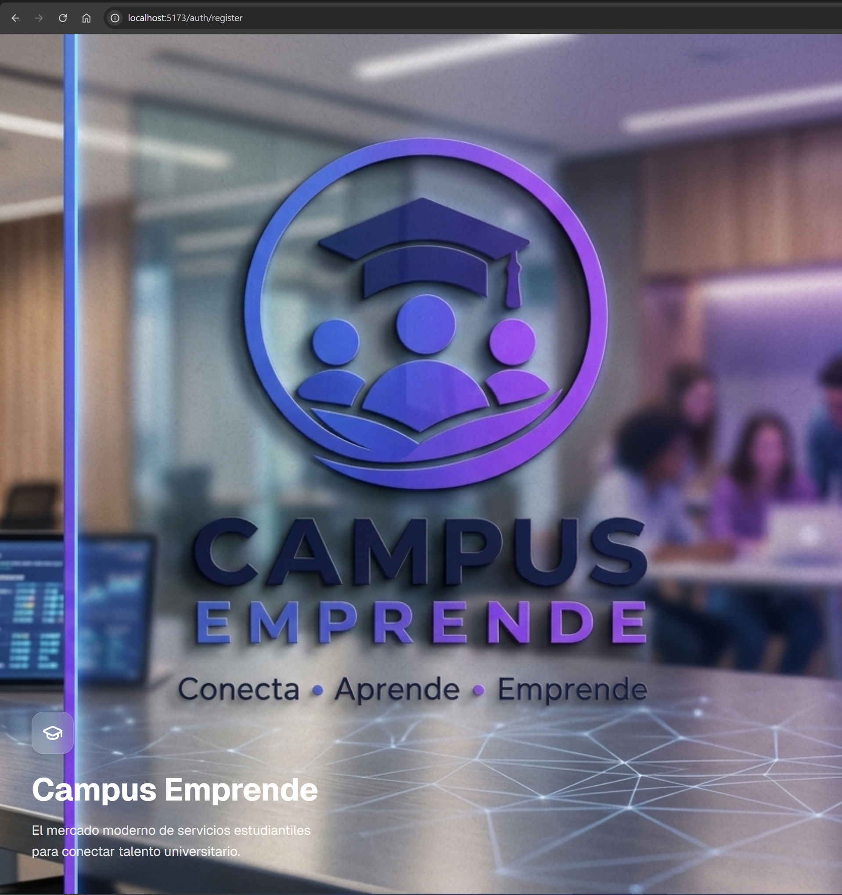

### ❗ Puntos Clave
- NO es un marketplace
- NO maneja pagos
- NO crea relaciones laborales

👉 Ayuda a los estudiantes a **registrar, seguir y demostrar su experiencia laboral**

---
## Caputuras de pantallas

#### Pagina principal

  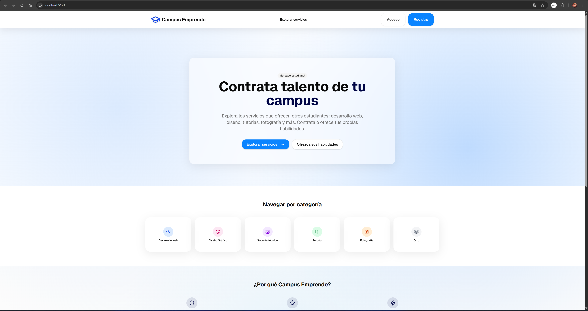

## Flujo del Proceso

1. El estudiante se registra con correo institucional
2. Crea su perfil profesional
3. Publica un servicio
4. El administrador aprueba/rechaza
5. Otro estudiante solicita el servicio
6. El servicio se completa
7. El cliente confirma la finalización
8. El cliente deja una calificación/reseña
9. El sistema lo almacena como experiencia verificada
---
#### Registro

  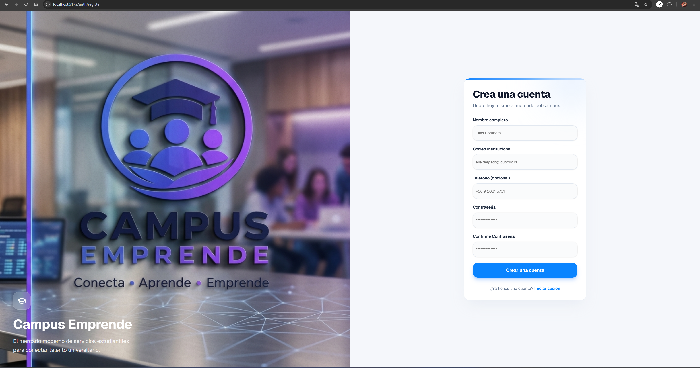

---
#### Perfil

  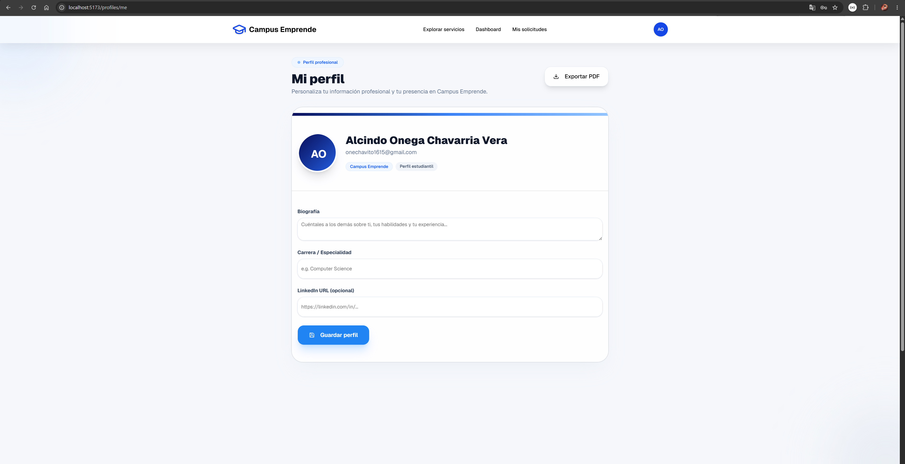

---
#### Publicar Servicio

  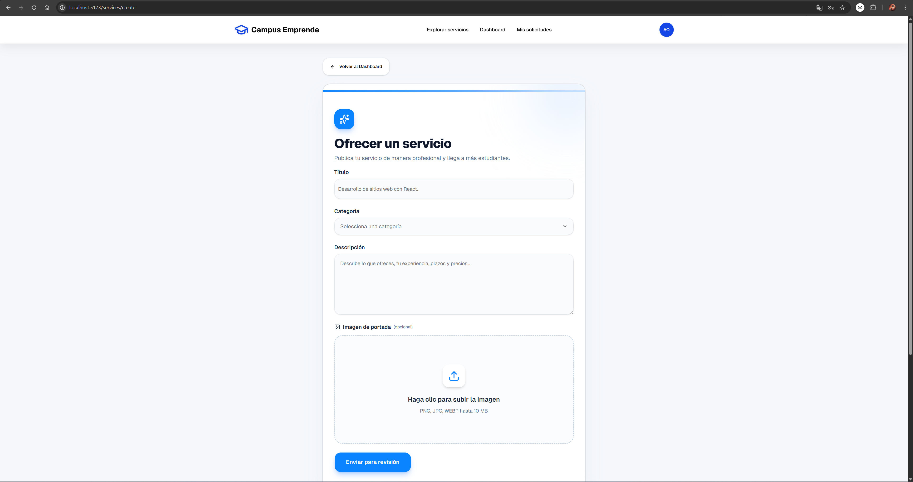

---
#### Dashboard Admin

  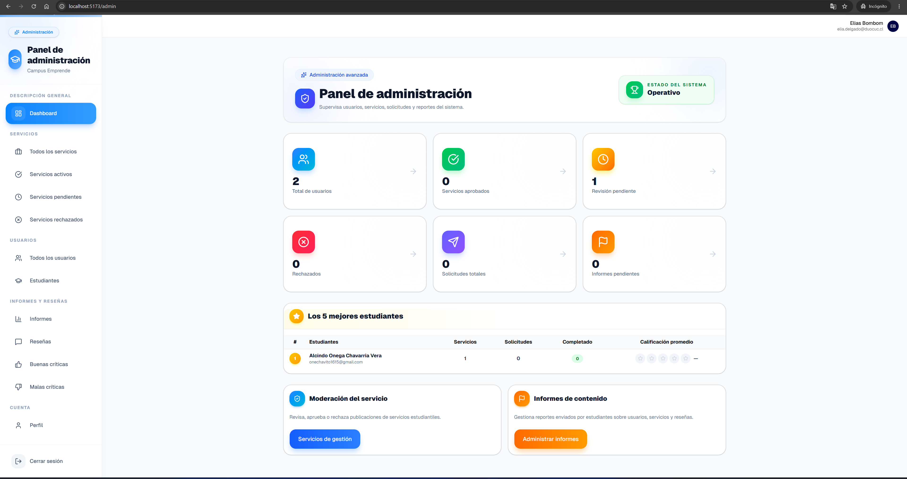

---
#### Rechazar o Aprobar servicio

  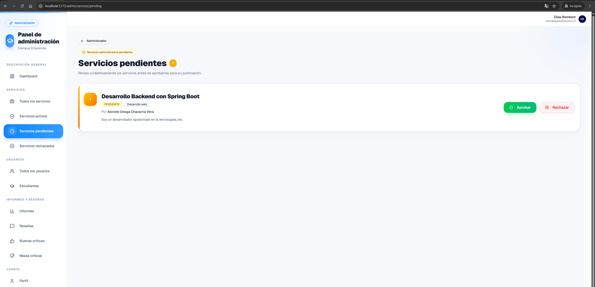

---
#### Solicitar servicio

  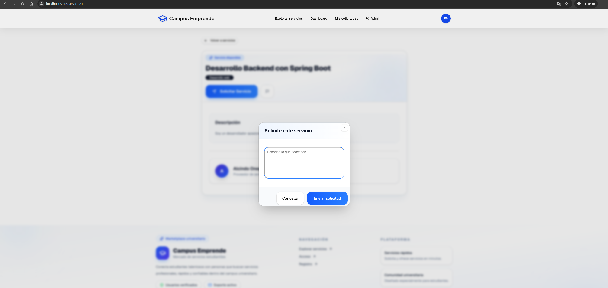

---
#### Servicio completado

  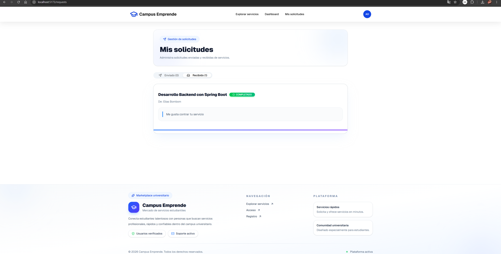

---
#### Calificacion de reseña

  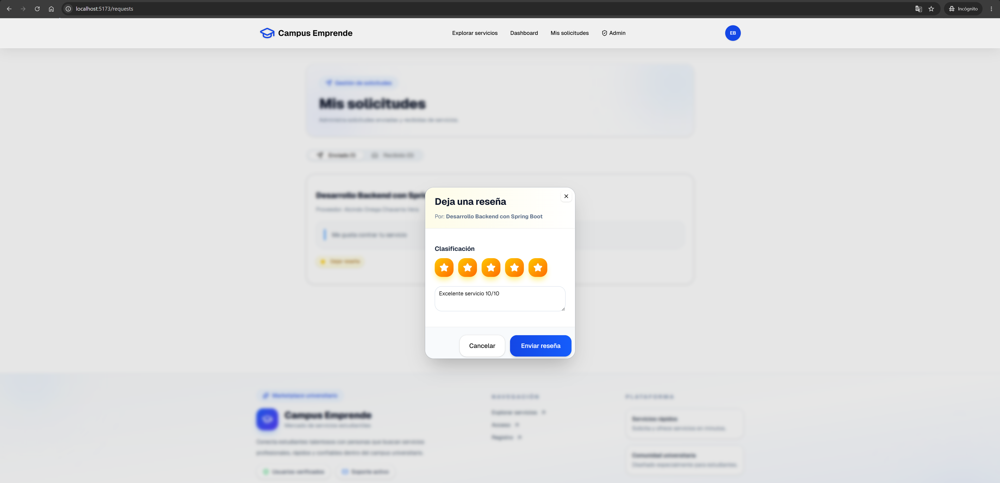

---
#### Panel de Administrador

  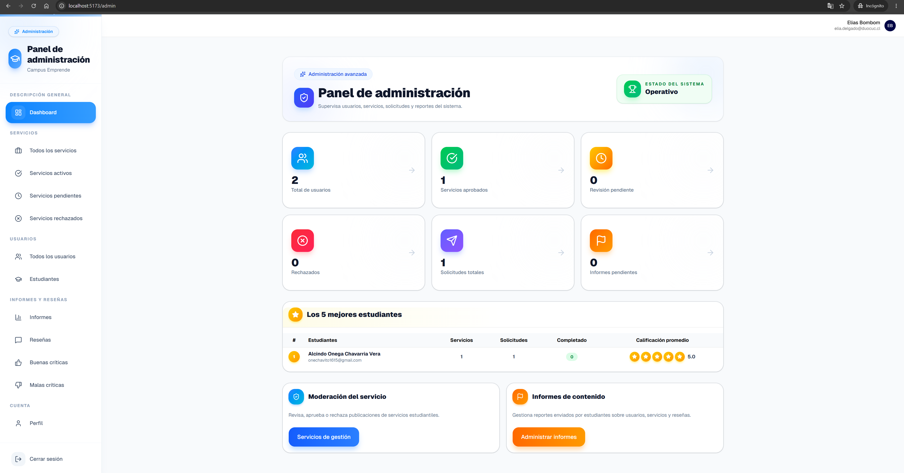

---
#### Todos los usuarios

  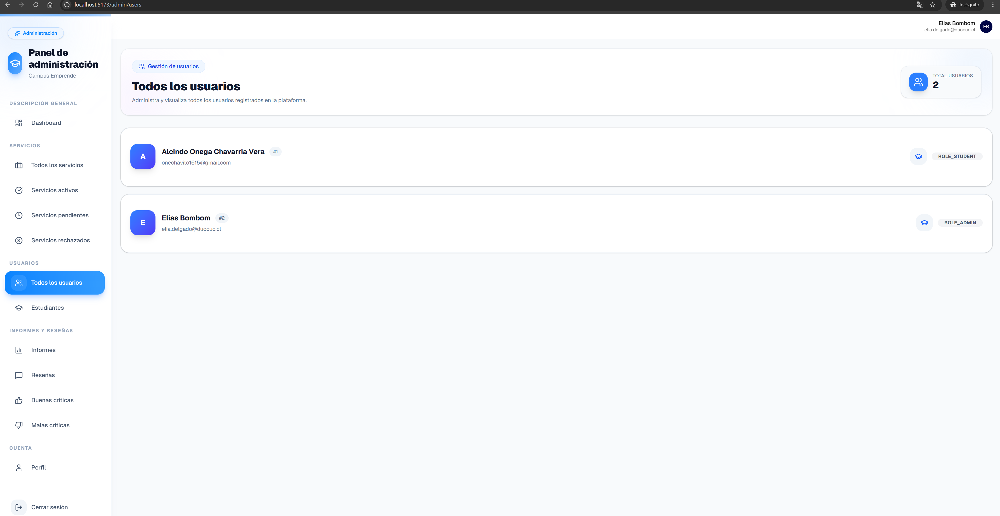

---
#### Restablecer contraseña

  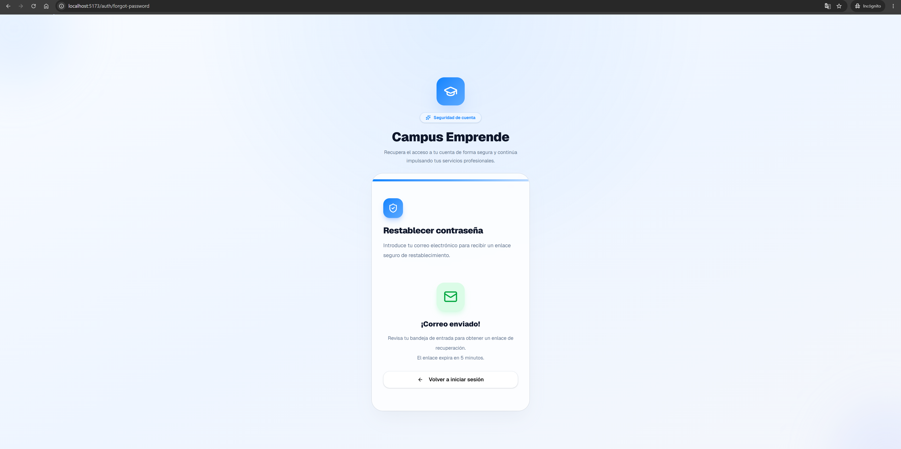

---
#### Solicitud Enviada al correo

  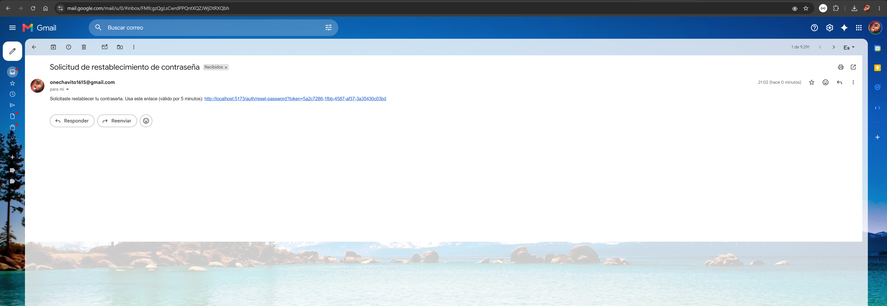

---
#### Contraseña restablecida exitosamente

  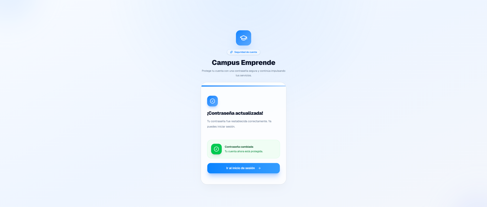

---
#### Pagina principal

  

---